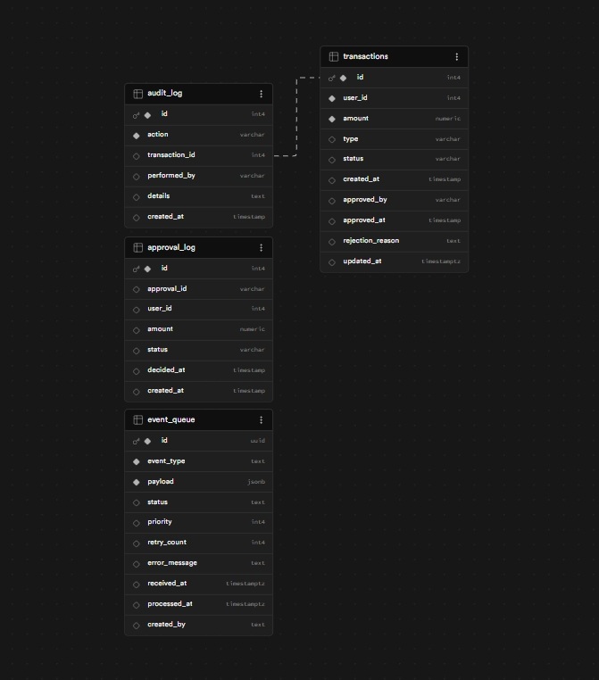
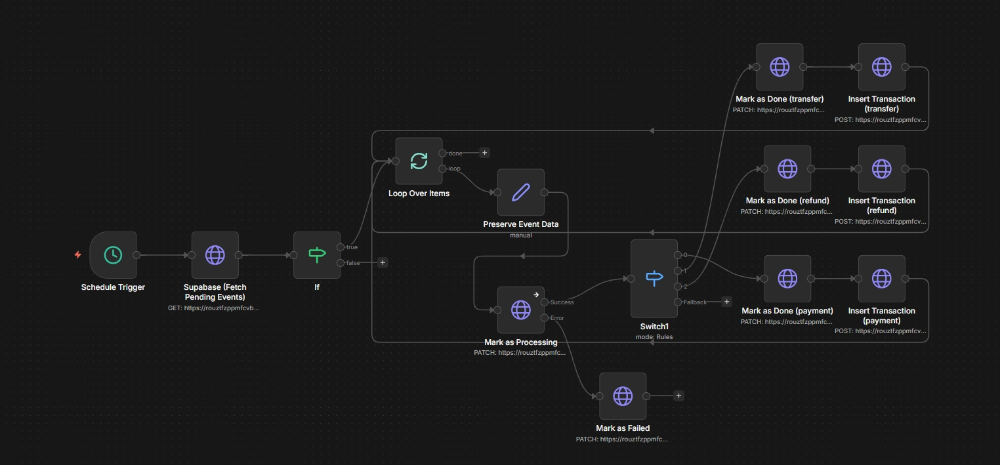
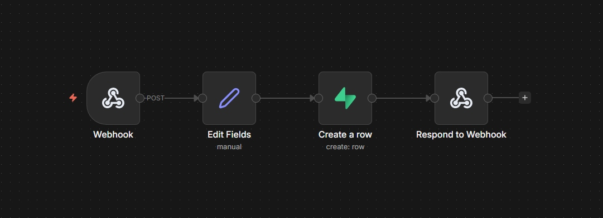
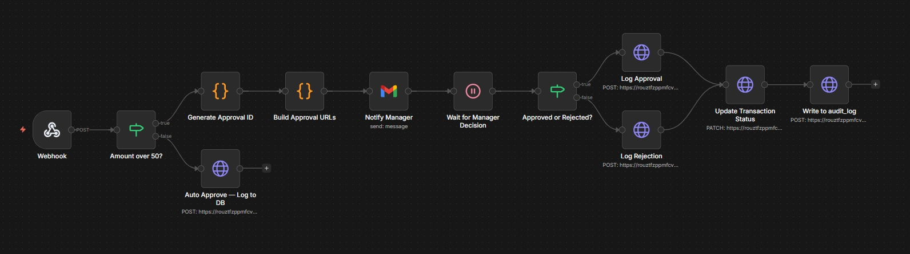
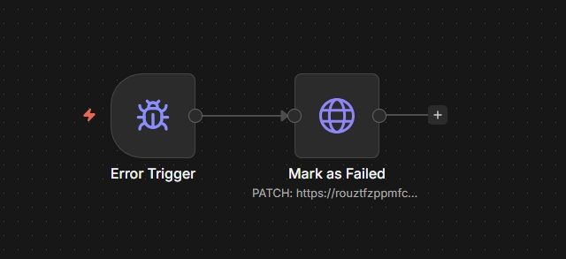
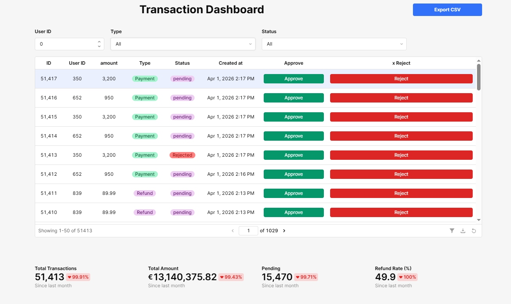
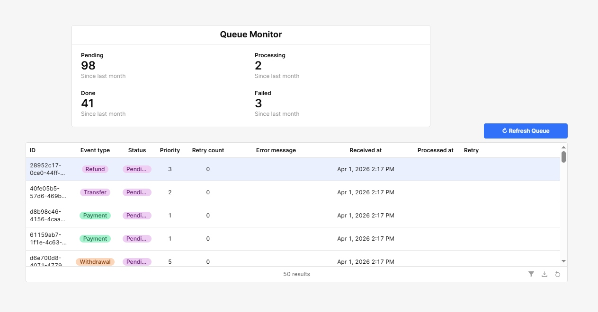
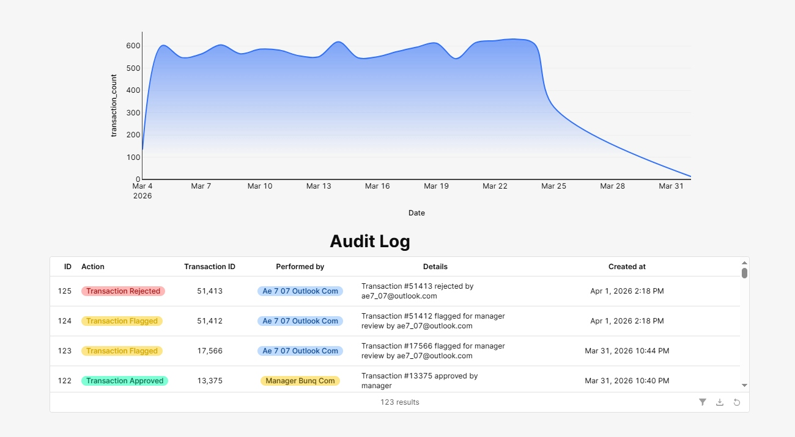

# Screenshots

This folder contains screenshots of the fintech-automation stack in production.

## Database Schema

*4-table Supabase schema: `transactions`, `audit_log`, `approval_log`, `event_queue`*

---

## n8n Workflows

### Queue Buffer Workflow

*Webhook → Edit Fields → Create a row in event_queue → Respond to Webhook*

### Transaction Processor Workflow

*Schedule Trigger → Fetch Pending Events → Loop → Switch by type → Mark Done + Insert Transaction*

### Approval Workflow

*Webhook → Amount threshold check → Gmail notification → Manager wait → Log decision → Update DB*

### Error Handler Workflow

*Error Trigger → Mark as Failed (PATCH event_queue)*

---

## Retool Dashboard

### Transaction Dashboard

*Paginated table with Approve/Reject per row, KPI cards, CSV export*

### Queue Monitor

*Real-time queue stats: Pending/Processing/Done/Failed with priority and retry tracking*

### Analytics Chart + Audit Log

*Daily transaction volume chart + immutable audit log with action badges*
